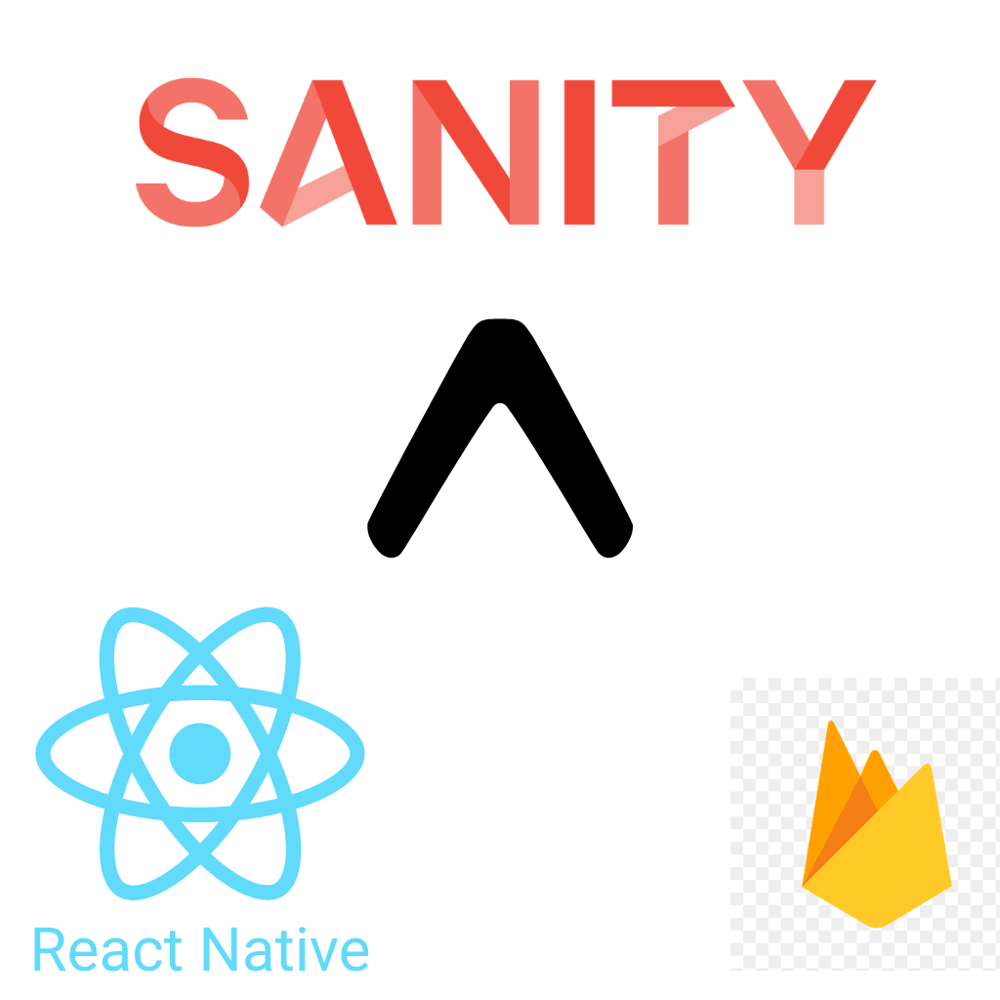

<h1 align="center">
  <br/>
Sanity Firebase Expo react native starter</h1>

> This Project is based on [https://github.com/obytes/react-native-template-obytes]

## Requirements

- [React Native dev environment ](https://reactnative.dev/docs/environment-setup)
- [Node.js LTS release](https://nodejs.org/en/)
- [Git](https://git-scm.com/)
- [Watchman](https://facebook.github.io/watchman/docs/install#buildinstall), required only for macOS or Linux users
- [Pnpm](https://pnpm.io/installation)
- [VS Code Editor](https://code.visualstudio.com/download) ⚠️ Make sure to install all recommended extension from `.vscode/extensions.json`


## Before you start


in order to manage releases flow and app versions and builds , we need to update our EAS_PROJECT_ID and EXPO_PROJECT_OWNER.
If you done have an expo account , Create one at https://expo.dev/, then create a project , you can easily grab those infos in your expo project dashboard. 
Once we have those infos , please update the .env.* file with the correct values.

```sh
const EXPO_ACCOUNT_OWNER = 'sanity-firebase-expo-react-native'; // expo account owner
const EAS_PROJECT_ID = 'your-expo-project-id'; // eas project id
```

 We need to set up some environnement variables. 
### Sanity.io configuration : 
- please follow the documentation in our Sanity services booking starter https://github.com/chikno/sanity-services-booking-starter

Once we have the project set up on sanity , please copy the PROJECT_ID and the DATASET_NAME , 
then open the .env.development or .env.staging or .env.production file , it depends on wich environnement we are deploying then , replace the SANITY_PROJECT_ID and SANITY_DATA_SET_NAME with the correct variables

### Firebase configuration

We are using Firebase for authentication and firestore to store user Personal informations and User Booking Data.
To configure Firebase auth using expo , please follow the following steps in expo official docs : 
https://docs.expo.dev/guides/using-firebase/
once you have the following values , please uopdate yout .env.x files

```sh
  apiKey: 'api-key',
  authDomain: 'project-id.firebaseapp.com',
  databaseURL: 'https://project-id.firebaseio.com',
  projectId: 'project-id',
  storageBucket: 'project-id.appspot.com',
  messagingSenderId: 'sender-id',
  appId: 'app-id',
  measurementId: 'G-measurement-id',
```

and we are ready to go further with the next steps.


## 👋 Quick start


Clone the repo to your machine and install deps :

```sh
git clone https://github.com/chikno/sanity-firebase-expo-react-native-starter

cd ./sanity-firebase-expo-react-native-starter

pnpm install
```

To run the app on ios

```sh
pnpm ios
```

To run the app on Android

```sh
pnpm android
```


To build on Preview mode
```sh
pnpm build:development:ios
pnpm build:development:android
```


To build on Staging mode
```sh
pnpm build:staging:ios
pnpm build:staging:android
```


To build on Production mode
```sh
pnpm build:producton:ios
pnpm build:producton:android
```


Please refer to https://github.com/obytes/react-native-template-obytes for more accurate Details.


Happy Coding
